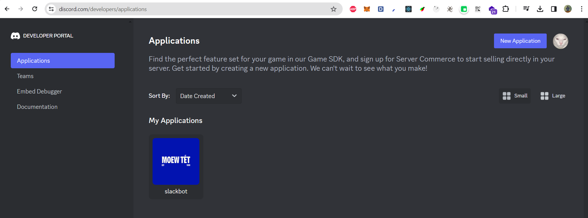
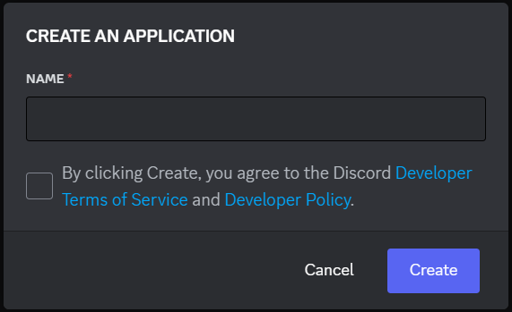
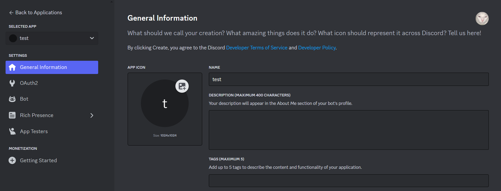
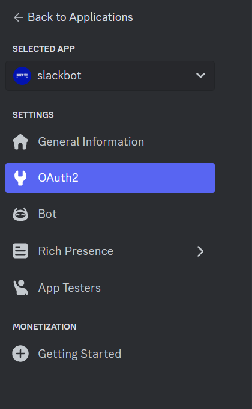
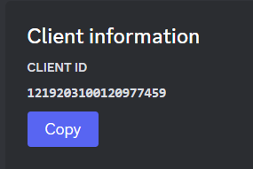
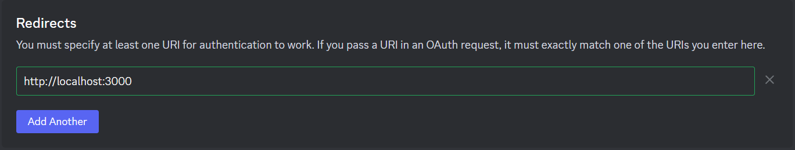
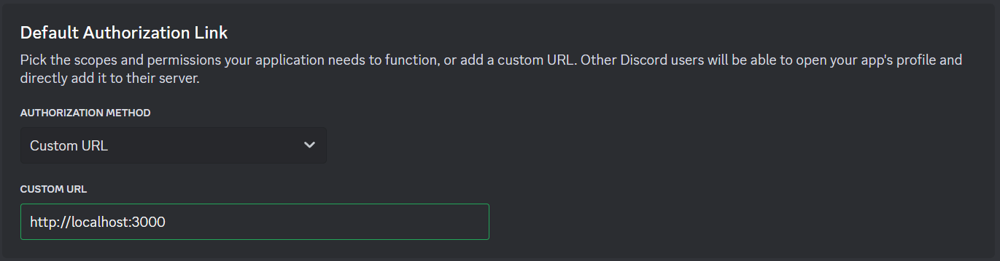
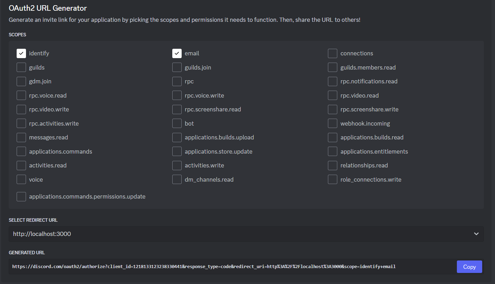

# Steps to Initialize Discord

### `1. Access Discord Website:`

Open a web browser and navigate to the Discord website at https://discord.com/developers/applications.

### `2. Choose "New Application":`

Select the "New Application" button on the right corner of the screen

### `3. Enter Name Of Application:`

Enter the name of the software then select `Create`

### `4. Customize Application (Optional):`

After creating your account, you can customize your application by adding a profile picture, description, and tags.

### `5. Get OAuth2 information:`

In the left menu bar, select the "OAuth2" tab. Information such as "Client ID", "Redirects", "Default Authorization Link", "OAuth2 URL Generator", "Generated Url" will be displayed

### `7. Using OAuth2:`

- In the `Client information` section, you can select the `Copy` button to get the `Client ID` added to the code.

- In the `Redirects` section, you will enter the domain you are using, for example "http://localhost:3000".

- In the `Default Authorization Link` section, you can enter the URL of the domain you are using.

- And in the `OAuth2 URL Generator`, you can generate an invite link for your application by picking the scopes and permissions it needs to function.Then, share the URL to others!

