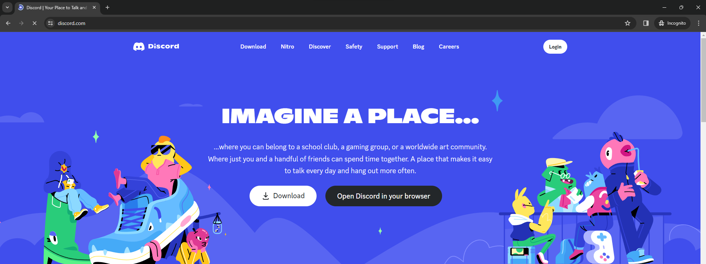
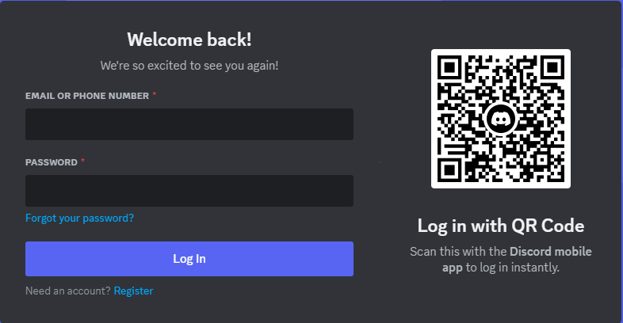
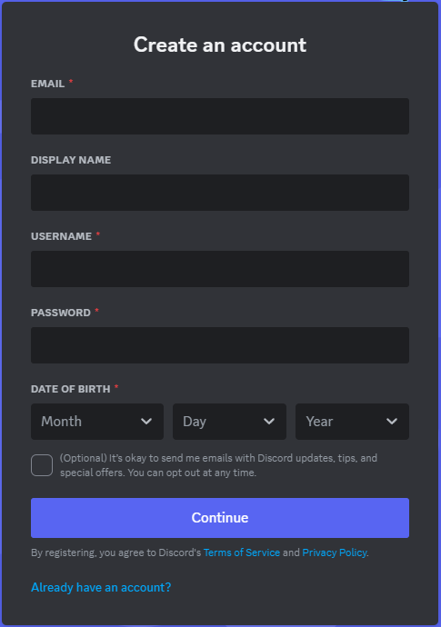
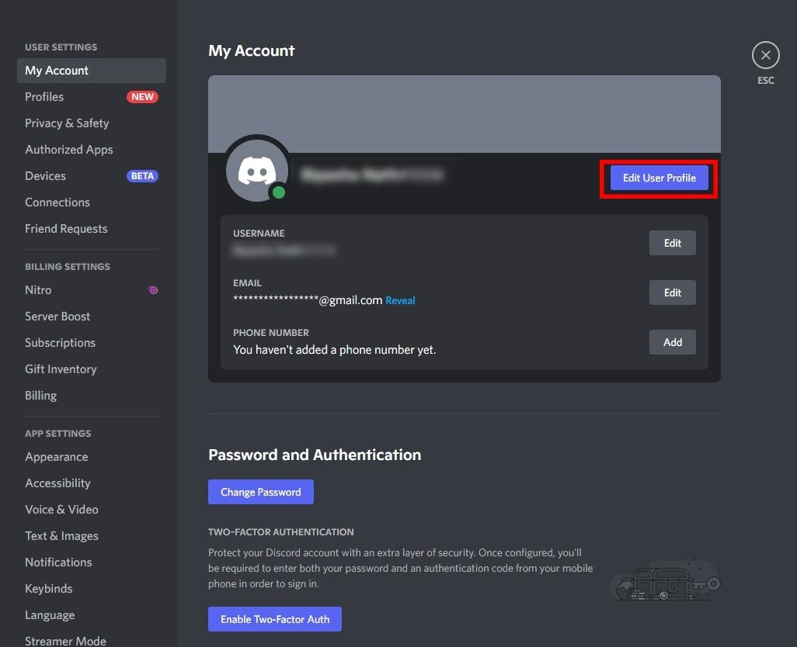

# Steps to create a Discord account

### `1. Access Discord Website:`

Open a web browser and navigate to the Discord website at https://discord.com.

### `2. Choose "Sign Up" or "Login":`

If you don't have a Discord account, click on `Sign Up`. If you already have an account, click on `Login` to sign in.

### `3. Enter Information:`

If you choose `Sign Up`, you'll be prompted to enter necessary information such as username, email address, and password. Fill in the information carefully and click `Sign Up` to proceed.

### `4. Email Verification (Optional):`

Discord may require you to verify your email address. Check your inbox for the verification email and follow the instructions provided.

### `5. Customize Account (Optional):`

After creating your account, you can customize your profile by adding a profile picture, description, and linking other services like Twitch or YouTube.

### `6. Join Servers:`

You can join existing servers or create a new server. Servers are where the Discord community interacts with each other.

### `7. Start Using Discord:`

Once you've completed all the steps above, you've successfully created a Discord account and can start using the platform to communicate with friends, family, or online communities.
